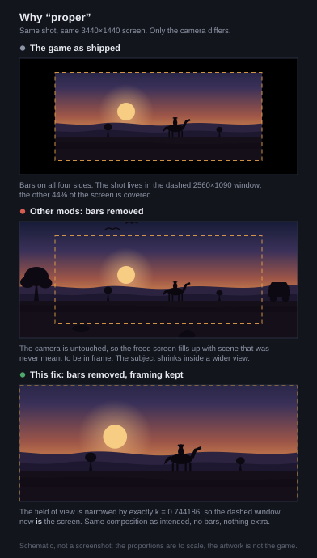

# RDR2 Ultrawide Cutscene Fix

Removes the cutscene black bars in Red Dead Redemption 2 **and keeps the original
framing**. Existing fixes only remove the bars, which leaves you seeing more of
the scene than the shot was composed for.

On ultrawide the game boxes cutscenes in on **all four sides** -- pillarbox left
and right, letterbox top and bottom. At 3440x1440 that is 440 px of side bar and
175 px of top bar, leaving 2560x1090 of a 3440x1440 screen. All of it goes.



## The problem

On a 16:9 display, RDR2 renders cutscenes into a 16:9 window and crops it to
2.35:1 with black bars. On a 3440x1440 display the game keeps that 16:9 window
and pillarboxes it, so the visible area is **2560x1090** inside a 3440x1440
screen — bars on all four sides.

Removing those bars reveals the rest of the frame, which the game renders but
never intended you to see. The horizontal field of view jumps from 72.7° to
89.4°: more image, wrong composition.

This plugin narrows the vertical field of view by exactly the amount that makes
the full ultrawide screen show what the 2560-wide window used to show:

```
k        = (16/9) / (width/height)          // 0.744186 at 3440x1440
vFOV_new = 2 * atan(k * tan(vFOV_old / 2))  // note: k scales the tangent
```

At 3440x1440, `k` works out to exactly `2560/3440` — the pillarbox ratio the
game itself computes. The correction is blended in and out with the game's own
letterbox animation, so the transition follows the bars rather than snapping.

## Status

| | |
|---|---|
| Field of view in cutscenes | works, verified frame by frame against a walkthrough recording |
| Fade in / fade out | smooth, follows the game's own easing |
| Black bars | removed, pillarbox and letterbox alike |
| Full-screen overlays and the intro video | fixed — they cover the whole screen, no smearing |
| Cinematic camera | corrected, including the cut into the shot |
| **Credit inserts and subtitles** | **not fixed yet — see below** |
| Rare single-frame flash | see below |

### Known issue: a rare single-frame flash

Very occasionally one frame is rendered without the correction and the picture
flashes. The cause is measured rather than suspected: the plugin recognises its
own output by value, and two different cameras can hold values that close by
coincidence. In one log our corrected 39.3139 sat 5e-6 away from another
camera's authored 39.3141 — inside the tolerance, so the authored value was
mistaken for ours and left alone.

Tightening the tolerance is not the answer; the rounding it has to catch is only
a factor of two away. The clean fix is to ask "did we write this value into
*this* camera", which is a larger change.

### Fixed: the artefacts in the former bar area

The intro's photographic filter and the intro video sample a 1920x1080 texture —
16:9 — and the game maps it into the 16:9 part of an ultrawide screen. Beyond
that, the sampler has nothing valid left and repeats the edge column, which is
the horizontal smearing that appears once the bars are gone.

The plugin intercepts that mapping and scales the asset up until it covers the
width, keeping its proportions and cropping 25% of the height — the same trade
the field-of-view correction makes.

### Known issue: credit inserts and subtitles

Credit inserts and subtitles are still laid out for the old 2560x1090 window and
appear too small. They have nothing to do with the artefacts above — that turned
out to be two separate problems wearing one description.

What is settled so far, each of it measured rather than assumed:

- the 2D layer lays out in a **16:9 box** (2560x1440 here), which cutscenes then
  crop to 2.35:1. `1440 x 16/9 = 2560` exactly, so there is no cutscene-specific
  rectangle to find
- it does **not** take that box from the game's computed bar heights: those have
  no consumer anywhere except drawing the bars, traced through xrefs
- nor from the script native that exposes the bar height, patched to zero and
  tested through a full cutscene
- nor from the aspect ratio getter, patched to report 16:9 from startup
- nor from the `SET_SCRIPT_GFX_ALIGN` family: both functions were hooked and
  counted through a whole cutscene and never executed once

[`docs/next-session.md`](docs/next-session.md) has the full list with the
evidence and the plan. Contributions welcome.

## Requirements

- Red Dead Redemption 2, tested on **1.0.1491.50**
- An ASI loader — [Ultimate ASI Loader, x64 `version.dll`](https://github.com/ThirteenAG/Ultimate-ASI-Loader/releases/download/x64-latest/version-x64.zip)
- An ultrawide display. On 16:9 the plugin computes `k = 1` and does nothing.

## Installation

Copy `RDR2UltrawideCutsceneFix.asi` into the game folder, next to `RDR2.exe`.

## Log

The plugin writes to `%LOCALAPPDATA%\RDR2UltrawideCutsceneFix\plugin.log`, not
to the game folder — the game process cannot create files there.

## Building

MSVC, x64. MinHook is fetched automatically.

```powershell
cmake --preset vs2026
cmake --build --preset release
.\build\Release\scanner_test.exe
```

`scanner_test.exe` covers the pattern scanner, the framing maths, the image
dumper and the log fallback, without a test framework.

## How it works

The short version: the plugin hooks the function that commits a camera state,
corrects the field of view of the camera that is actually being rendered, once
per frame, using a factor derived from the game's own letterbox geometry.

Every part of that sentence is load-bearing and each was arrived at by
measurement:

- [`docs/how-it-works.md`](docs/how-it-works.md) — the runtime chain, the three
  rules in the detour, and what did not work
- [`docs/ghidra.md`](docs/ghidra.md) — what is in the unpacked image, and how the
  write site was found
- [`docs/measurements.md`](docs/measurements.md) — the numbers taken from the
  running game
- [`docs/packing.md`](docs/packing.md) — RDR2.exe is Arxan-packed, so nothing can
  be found in the file on disk; the plugin dumps the decrypted image out of the
  running process for analysis
- [`docs/next-session.md`](docs/next-session.md) — the plan for the 2D layer, and
  why the approaches so far all failed the same way

The "what did not work" list is the part worth reading before touching this:
hooking the FOV getter, overwriting the master global, and searching for the
write site statically all look reasonable and all fail.

## Credits

The two AOB signatures used to locate the letterbox state were lifted from
`RDR2NoBlackBars.asi`, which carries them as plaintext strings in its binary.

## License

MIT, see [LICENSE](LICENSE).
